## Q1. Duplicate Records

**Question:** Using the geolocation table, identify duplicate records based on geolocation_zip_code_prefix, geolocation_lat, geolocation_lng, geolocation_city, and geolocation_state.

**Answer:**

```sql
select geolocation_zip_code_prefix,
geolocation_lat, 
geolocation_lng,
geolocation_city, 
geolocation_state,
count (*)
from geolocation
group by geolocation_zip_code_prefix,
geolocation_lat, 
geolocation_lng,
geolocation_city, 
geolocation_state
having COUNT (*) > 1;
```

**Output:**

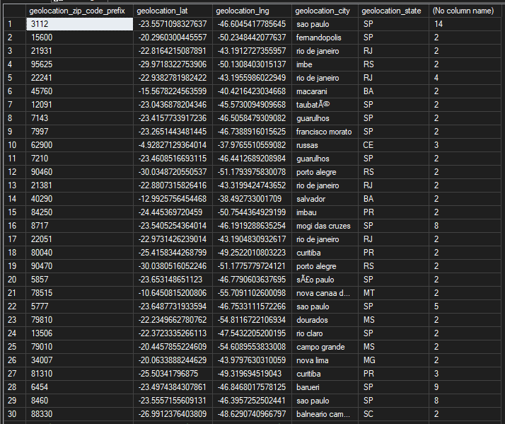

---

## Q2. First, Second, Third Highest Value

**Question:** Find the First, Second, Third Highest Payment_Value from the payments table.

**Answer:**

```sql
1. First highest Value
1. Values Only

select MAX (payment_value) from payments;

2. Full Row Fetching (Using Windows Function)

with table_seg as (
select *,
RANK () over (order by payment_value desc) as Rank
from payments
)
select * from table_seg
where Rank = 1

2. Second highest Value

3. Values Only

select MAX (payment_value) from payments
where payment_value < (select MAX (payment_value) from 
payments);

4. Full Row Fetching (Using Windows Function)

with table_seg as (
select *,
RANK () over (order by payment_value desc) as Rank
from payments
)
select * from table_seg
where Rank = 2

3. Third highest Value

Limit & Offset Method (Common for all)

select * from payments
order by payment_value desc
offset 2 rows fetch next 1 rows only;
```

**Output:**


---

## Q3. Records Without a Related Record

**Question:** Using the products and order_items tables, identify products that have never been sold.

**Answer:**

```sql
select p.product_id, 
p.product_category_name_english as pur_cat
from products p left join order_items o
on p.product_id = o.product_id
where o.product_id is null;
```

**Output:**


---

## Q4. Total Revenue per Product

**Question:** Using the order_items table, calculate the total revenue generated by each product using product_id and price.

**Answer:**

```sql
select product_id, round(sum(price),0) as Toatl_sales
from order_items
group by product_id;
```

**Question:** Using the order_items table, calculate the total revenue generated by each product using price.

**Answer:**

```sql
with join_cat as (
select p.product_category_name_english as pro_cat, o.price 
from products p join order_items o
on p.product_id = o.product_id
)
select pro_cat, round(sum(price),0) as total_sales
from join_cat
group by pro_cat
order by sum(price) desc;
```

**Output:**

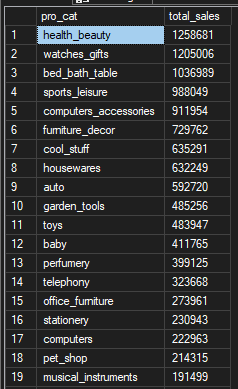

---

## Q5. Top 3 Highest Values

**Question:** Using the order_items table, find the top 3 products with the highest total revenue.

**Answer:**

```sql
select top 3 product_id, 
round(sum(price), 0) as total_revenue 
from order_items
group by product_id
order by sum(price) desc;
```

**Output:**

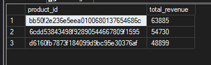

---

## Q6. Above Group Average

**Question:** Find products whose average selling price is higher than the average selling price of their product category, using the order_items and products tables.

**Answer:**

```sql
with join_seg as (
select p.product_category_name_english as pro_cat,
o.product_id, round (o.price, 0) as sales
from products p join order_items o
on p.product_id = o.product_id
)
select p.product_id,p.pro_cat, p.sales
from join_seg p
where p.sales > 
(select avg(m.sales) as pro_avg from join_seg m
where m.pro_cat = p.pro_cat);
```

**Output:**

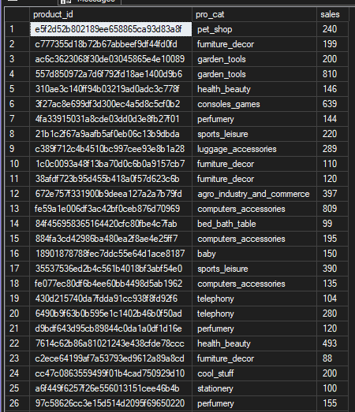

---

## Q7. Groups with More Than 5 Records

**Question:** Using the products table, find product categories that contain more than 5 products_id.

**Answer:**

```sql
select product_category_name_english as pro_cat,
COUNT (product_id) as customer_count
from products
group by product_category_name_english
having COUNT (product_id) > 5
order by COUNT (product_id) desc;
```

**Output:**

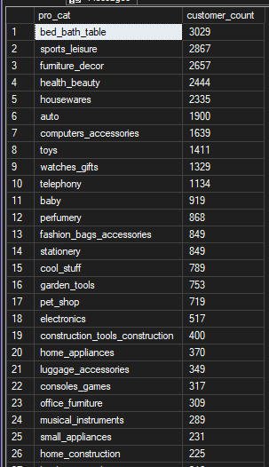

---

## Q8. Customers Without Orders

**Question:** Using the customers and orders tables, retrieve customers who have never placed an order.

**Answer:**

```sql
select distinct (c.customer_unique_id) as unique_cus
from customers c left join orders o
on c.customer_id = o.customer_id
where o.order_purchase_timestamp is null;
```

**Output:**


---

## Q9. Total Sales and Order Count per Customer

**Question:** Using the customers, orders, and payments tables, find the total payment amount and total number of orders for each customer.

**Answer:**

```sql
with join_seg as (
select c.customer_unique_id as customer_id,
o.order_purchase_timestamp as date,
p.payment_value
from customers c join orders o
on c.customer_id = o.customer_id
join payments p
on o.order_id = p.order_id
)
select customer_id, 
count(date) as order_count, 
sum(payment_value) as total_price
from join_seg
group by customer_id
order by count(date) desc;
```

**Output:**

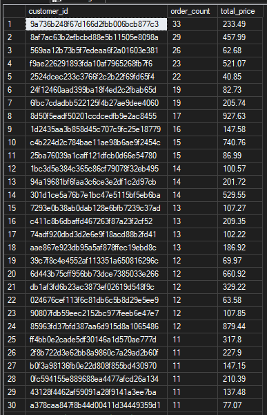

---

## Q10. Orders in the Last 30 Days

**Question:** Using orders.order_purchase_timestamp, identify orders placed within the last 30 days, using the latest order date in the dataset as the reference date.

**Answer:**

```sql
select * from orders
where order_purchase_timestamp >= (
select 
DATEADD (DAY, -30, max (order_purchase_timestamp))
from orders
)
order by order_purchase_timestamp desc;
```

**Output:**

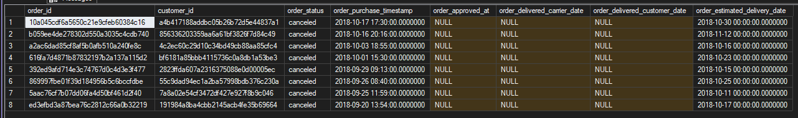

---

## Q11. Ranking Within a Category

**Question:** Using the products and order_items tables, rank products by total revenue within each product category.

**Answer:**

```sql
with join_seg as (
select p.product_category_name_english as product_category,
p.product_id,
round(sum(o.price),0) as price
from products p join order_items o
on p.product_id = o.product_id
group by p.product_category_name_english, p.product_id
)
select product_category, product_id, price,
RANK () over 
(partition by product_category order by price desc) as ranking 
from join_seg;
```

**Output:**

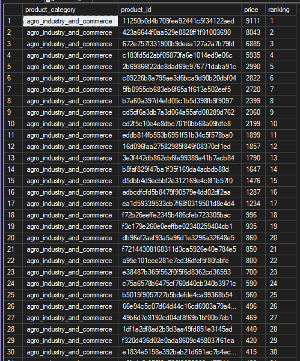

---

## Q12. Most-Selling Product

**Question:** Using the order_items table, identify the most-selling product based on the number of times the product appears in order items.

**Answer:**

```sql
select top 1 product_id,
COUNT (order_item_id) as count_order_id
from order_items
group by product_id
order by COUNT (order_item_id) desc;
```

**Output:**

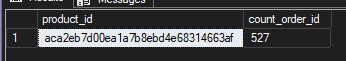

---

## Q13. Revenue and Order Count by Region

**Question:** Using the customers, orders, and payments tables, calculate the total revenue and number of orders for each customer state.

**Answer:**

```sql
with join_seg as (
select c.customer_state,
o.order_id, p.payment_value
from customers c join orders o
on c.customer_id = o.customer_id
join payments p
on o.order_id = p.order_id
)
select customer_state,
COUNT (distinct order_id) as order_count,
Round (SUM (payment_value),0) as total_revenue
from join_seg
group by customer_state
order by COUNT (distinct order_id) desc;
```

**Output:**

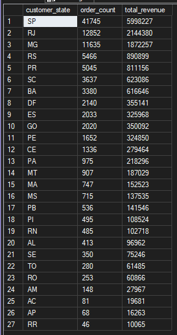

---

## Q14. Customers with More Than 5 Orders

**Question:** Using the orders table, identify customers who have placed more than 5 orders, and then calculate the total number of such customers.

**Answer:**

```sql
select count (*) as customers_more_than_5_orders 
from (
select customer_id, 
count(order_id) as order_count
from orders
group by customer_id
having count(order_id) > 5)
as count_orders;
```

**Output:**

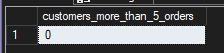

---

## Q15. Orders Above Average Value

**Question:** Using the orders and payments tables, identify customers who have placed at least one order whose payment value is greater than the average order payment value.

**Answer:**

```sql
with join_seg as (
select o.customer_id, o.order_id, p.payment_value
from orders o join payments p
on o.order_id = p.order_id
),
avg_seg as (
select customer_id, order_id, payment_value
from join_seg 
where payment_value > (
select AVG (payment_value) from join_seg
))
select distinct customer_id
from avg_seg;
```

**Output:**

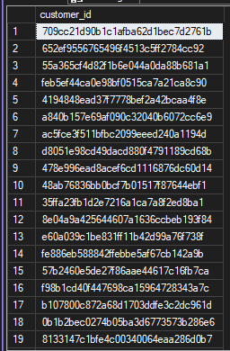

---

## Q16. Date-Based Filtering

**Question:** Using orders.order_purchase_timestamp, identify all orders that were placed on Saturday or Sunday.

**Answer:**

```sql
select *, 
DATENAME (WEEKDAY, order_purchase_timestamp) as Day_Name
from orders
where DATENAME (WEEKDAY, order_purchase_timestamp) = 'Saturday' 
or
DATENAME (WEEKDAY, order_purchase_timestamp) = 'Sunday';
```

**Output:**

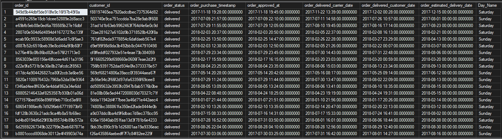

---

## Q17. Values Within a Range

**Question:** Using the payments table, find orders whose payment_value is between 500 and 1,000.

**Answer:**

```sql
select * from payments 
where payment_value between 500 and 1000
order by payment_value desc;
```

**Output:**

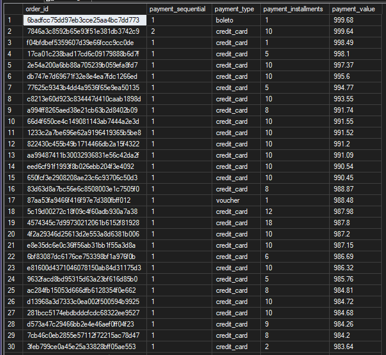

---

## Q18. Monthly Revenue and Order Count

**Question:** Using the orders and payments tables, calculate the monthly total revenue and number of orders based on order_purchase_timestamp.

**Answer:**

```sql
with join_seg as (
select 
YEAR(o.order_purchase_timestamp) as Year,
MONTH(o.order_purchase_timestamp) as Month,
DATENAME (MONTH, o.order_purchase_timestamp) as month_name,
p.order_id, p.payment_value
from orders o join payments p
on o.order_id = p.order_id
)
select Year, Month, month_name,
COUNT (distinct order_id) as order_count,
Round (SUM (payment_value),0) as total_revenue
from join_seg
group by Year, Month, month_name
order by Year, Month;
```

**Output:**

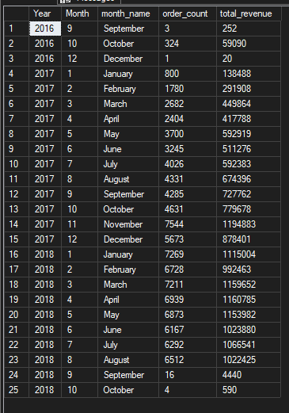

---

## Q19. Ranking Within a Group

**Question:** Using the sellers, orders, and order_items tables, rank sellers by total revenue within each seller state.

**Answer:**

```sql
with join_seg as (
select s.seller_state, s.seller_id, 
round(sum(o.price),0) as total_revenue 
from sellers s join order_items o
on s.seller_id = o.seller_id
group by s.seller_state, s.seller_id
)
select seller_state, seller_id, total_revenue,
RANK () over 
(partition by seller_state order by total_revenue desc) as rank
from join_seg;
```

**Output:**

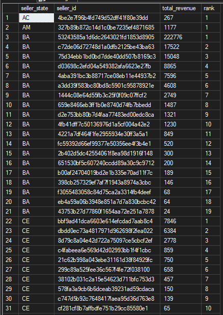

---

## Q20. Customers Active Every Month

**Question:** Using the orders table, identify customers who placed at least one order in every month of 2017.

**Answer:**

```sql
with filter_2017 as (
select customer_id,
YEAR (order_purchase_timestamp) as year,
MONTH (order_purchase_timestamp) as month
from orders
where YEAR (order_purchase_timestamp) = 2017
)
select customer_id, month
from filter_2017
group by customer_id, month
having count (distinct month) = 12;
```

**Output:**

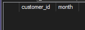

---

## Q21. Moving Average

**Question:** Using the orders and payments tables, calculate the 3-day moving average of daily revenue based on the order purchase date.

**Answer:**

```sql
with join_seg as (
select 
cast (o.order_purchase_timestamp as date) as date,
round(sum(p.payment_value),0) as total_sales
from orders o join payments p
on o.order_id = p.order_id
group by cast (o.order_purchase_timestamp as date)
)
select date, total_sales,
round (AVG (total_sales) 
over (order by date 
rows between 2 preceding and current row), 0) as rolling_avg
from join_seg
order by date;
```

**Output:**

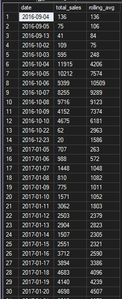

---

## Q22. First and Last Order

**Question:** Using the customers and orders tables, find the first and most recent order date for each customer.

**Answer:**

```sql
with join_seg as (
select distinct c.customer_unique_id,
cast (o.order_purchase_timestamp as date) as date
from customers c join orders o
on c.customer_id = o.customer_id
),
max_min as (
select customer_unique_id, date,
MIN (date) 
over (partition by customer_unique_id 
order by date) as First_order_date,
MAX (date) 
over (partition by customer_unique_id 
order by date) as Latest_order_date
from join_seg
)
select customer_unique_id,
First_order_date, 
Latest_order_date
from max_min;
```

**Output:**

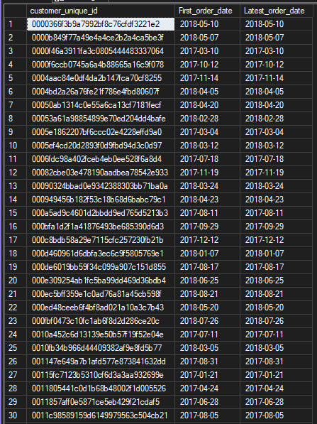

---

## Q23. Revenue Distribution Percentage

**Question:** Using the order_items table, calculate each product's revenue and its percentage contribution to the overall product revenue.

**Answer:**

```sql
with join_seg as (
select p.product_category_name_english as product_name,
round(sum(o.price),0) as product_sales
from products p join order_items o
on p.product_id = o.product_id
group by p.product_category_name_english
),
t_sales as (
select round(sum(price),0) as Total_Sales
from order_items
)
select p.product_name, 
p.product_sales,
t.Total_Sales,
round (((p.product_sales / t.Total_Sales) * 100), 2) as per_contribution
from join_seg p cross join t_sales t
order by p.product_sales desc;
```

**Output:**

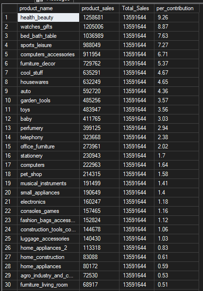

---

## Q24. Consecutive Purchases

**Question:** Using the orders table, identify customers who placed orders on two consecutive days, where the difference between two purchase dates is exactly 1 day.

**Answer:**

```sql
with join_seg as (
select c.customer_unique_id as customer_id,
cast (o.order_purchase_timestamp as date) as date
from customers c join orders o
on c.customer_id = o.customer_id
group by c.customer_unique_id,
cast (o.order_purchase_timestamp as date)
),
lag_seg as (
select customer_id, date,
LAG (date) 
over (partition by customer_id order by date) as previous_date,
DATEDIFF (DAY, 
LAG (date) 
over (partition by customer_id 
order by date), 
date) as Date_Difference
from join_seg
)
select customer_id, date, 
previous_date, Date_Difference
from lag_seg
where Date_Difference = 1;
```

**Output:**

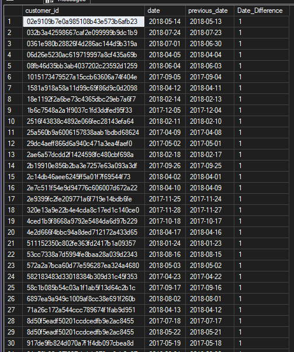

---

## Q25. Churned Customers

**Question:** Using the orders table, identify customers whose most recent order was more than 6 months before the latest order date available in the dataset.

**Answer:**

```sql
with latest_seg as (
select customer_id,
MAX (cast (order_purchase_timestamp as date)) as lastest_order
from orders
group by customer_id
),
last_6_month as (
select
DATEADD (MONTH, -6, 
MAX (cast (order_purchase_timestamp as date))) as last_six_month
from orders
)
select l.customer_id, l.lastest_order,
s.last_six_month
from latest_seg l cross join last_6_month s
where l.lastest_order < s.last_six_month;
```

**Output:**

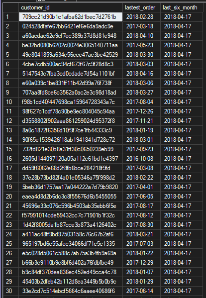

---

## Q26. Top 3 Products by Revenue in Each Product Category

**Question:** Using order_items and products, find the top 3 products by total sales within each product category.

**Answer:**

```sql
with pro_group as (
select 
p.product_category_name_english as product_name,
oi.product_id, round (SUM (oi.price),0) as total_price 
from order_items oi join products p 
on oi.product_id = p.product_id 
group by p.product_category_name_english, oi.product_id
),
ranking_group as (
select product_name, product_id, total_price, 
RANK () over (partition by product_name order by total_price desc) as 
price_ranking
from pro_group
)
select product_name, product_id, total_price, price_ranking 
from ranking_group 
where price_ranking <= 3;
```

**Output:**

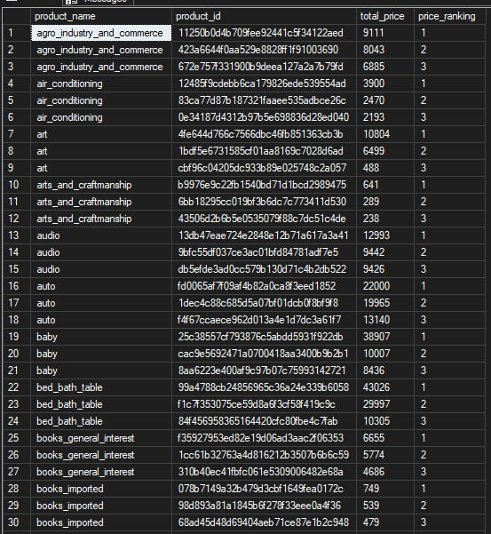

---

## Q27. Top 2 Sellers by Total Sales in Each Seller State

**Question:** Using order_items and sellers, find the top 2 sellers by total sales within each seller state.

**Answer:**

```sql
with seller_group as (
select s.seller_state,
oi.seller_id, round(sum(oi.price),0) as total_price 
from order_items oi join sellers s 
on oi.seller_id = s.seller_id 
group by s.seller_state, oi.seller_id
),
ranking_group as (
select seller_state, seller_id, total_price, 
RANK () over (partition by seller_state order by total_price desc) as ranking
from seller_group
)
select seller_state, seller_id, total_price, ranking
from ranking_group where ranking <= 2;
```

**Output:**

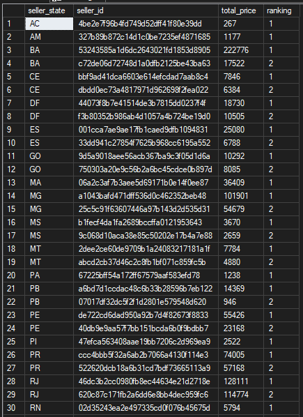

---

## Q28. Highest-Revenue Product in Each Category

**Question:** For every product category, identify the product generating the highest total revenue.

**Answer:**

```sql
with grouping_segment as (
select p.product_category_name_english as product_name,
oi.product_id, round(sum(oi.price),0) as total_sales
from order_items oi join products p
on oi.product_id = p.product_id
group by p.product_category_name_english, oi.product_id
),
ranking_segment as (
select product_name, product_id, total_sales,
RANK () over (partition by product_name order by total_sales desc) as ranking
from grouping_segment
)
select product_name, product_id, total_sales, ranking
from ranking_segment where ranking = 1;
```

**Output:**

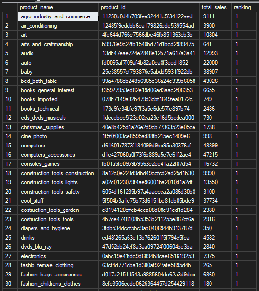

---

## Q29. Customers with Consecutive Purchase Days

**Question:** Identify customers who placed orders on consecutive calendar days.

**Answer:**

```sql
with distinct_segment as (
select distinct c.customer_unique_id, 
cast (o.order_purchase_timestamp as date) as purchase_date
from customers c join orders o
on c.customer_id = o.customer_id
),
date_shift as (
select customer_unique_id, purchase_date,
LAG (purchase_date) over (partition by customer_unique_id order by 
purchase_date) as date_shift
from distinct_segment
)
select customer_unique_id, purchase_date, date_shift
from date_shift where DATEDIFF (day,date_shift, purchase_date) = 1 
order by customer_unique_id, purchase_date;
```

**Output:**

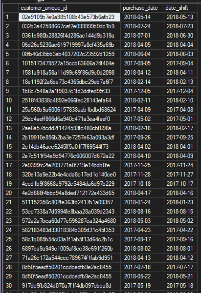

---

## Q30. Customers Whose Purchase Gap Exceeded 30 Days

**Question:** For repeat customers, calculate the number of days between purchases and identify customers where the gap was greater than 30 days.

**Answer:**

```sql
with distinct_segment as (
select distinct c.customer_unique_id, cast (o.order_purchase_timestamp as 
date) as purchase_date
from customers c join orders o
on c.customer_id = o.customer_id
),
date_shift as (
select customer_unique_id, purchase_date,
LAG (purchase_date) over (partition by customer_unique_id order by 
purchase_date) as Date_shift
from distinct_segment
),
date_difference as (
select customer_unique_id, purchase_date, Date_shift, 
DATEDIFF (day,Date_shift, purchase_date) as Date_Difference
from date_shift
)
select customer_unique_id, purchase_date, Date_shift, Date_Difference
from date_difference
where Date_Difference > 30;
```

**Output:**

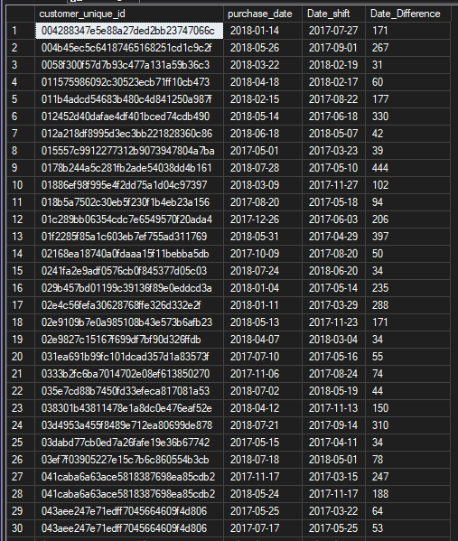

---

## Q31. Longest Customer Purchase Streak

**Question:** Find the customer who has the longest sequence of consecutive purchase days.

**Answer:**

```sql
WITH distinct_segment AS (
 SELECT DISTINCT
 c.customer_unique_id,
 CAST (o.order_purchase_timestamp AS DATE) AS purchase_date
 FROM customers c
 JOIN orders o
 ON c.customer_id = o.customer_id
),
date_shift AS (
 SELECT
 customer_unique_id,
 purchase_date,
 LAG (purchase_date) OVER (
 PARTITION BY customer_unique_id
 ORDER BY purchase_date
 ) AS date_shift
 FROM distinct_segment
),
streak_group AS (
 SELECT
 customer_unique_id,
 purchase_date,
 SUM (
 CASE
 WHEN date_shift IS NULL
 OR DATEDIFF (DAY, date_shift, purchase_date) <> 1
 THEN 1
 ELSE 0
 END
 ) OVER (
 PARTITION BY customer_unique_id
 ORDER BY purchase_date
 ) AS streak_id
 FROM date_shift
),
streak_count AS (
 SELECT
 customer_unique_id,
 streak_id,
 COUNT (*) AS streak_length
 FROM streak_group
 GROUP BY customer_unique_id, streak_id
)
SELECT TOP 1
 customer_unique_id,
 streak_length
FROM streak_count
ORDER BY streak_length DESC;
```

**Output:**

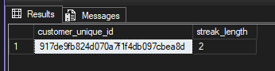

---

## Q32. Daily Cumulative Revenue

**Question:** Calculate daily revenue and cumulative revenue over time.

**Answer:**

```sql
with date_sum as (
select CAST (o.order_purchase_timestamp as date) as purchase_date,
sum(p.payment_value) as payments
from orders o join payments p
on o.order_id = p.order_id
group by CAST (o.order_purchase_timestamp as date)
),
cum_sum as (
select purchase_date, payments,
SUM (payments) over (order by purchase_date) as cumulative_payment
from date_sum
)
select purchase_date, payments, cumulative_payment
from cum_sum
order by purchase_date, payments, cumulative_payment;
```

**Output:**

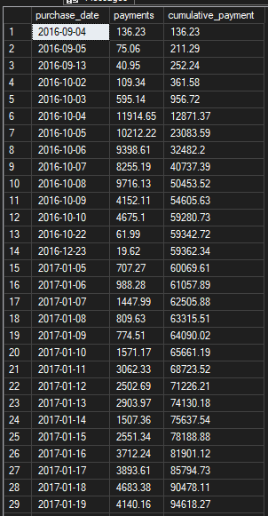

---

## Q33. Customer Cumulative Spending

**Question:** For every customer, show the order date, purchase amount, and cumulative spending up to that purchase.

**Answer:**

```sql
with three_table as (
select c.customer_unique_id,
o.order_id, cast (o.order_purchase_timestamp as date) as purchase_date,
p.payment_value
from customers c join orders o
on c.customer_id = o.customer_id
join payments p
on o.order_id = p.order_id
)
select customer_unique_id, order_id, purchase_date, payment_value,
SUM (payment_value) over (partition by customer_unique_id order by 
purchase_date) as cumulative_spending
from three_table;
```

**Output:**

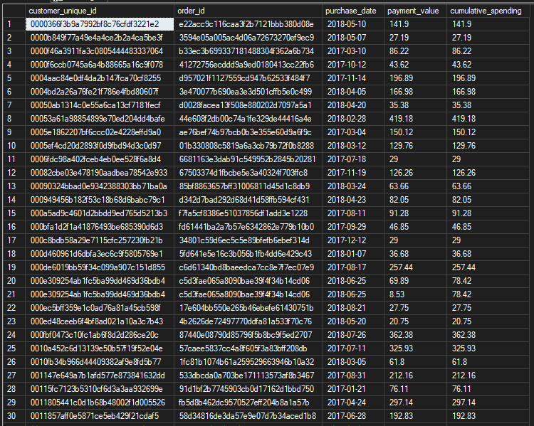

---

## Q34. Monthly Cumulative Revenue

**Question:** Calculate monthly revenue and year-to-date cumulative revenue.

**Answer:**

```sql
with join_seg as (
select o.order_id, cast (o.order_purchase_timestamp as date) as purchase_date,
p.payment_value
from orders o join payments p
on o.order_id = p.order_id
),
date_extract as (
select order_id, purchase_date, 
YEAR (purchase_date) as year_col,
MONTH (purchase_date) as month_col,
Datename (month, purchase_date) as month_name_col,
DAY (purchase_date) as day_col,
payment_value
from join_seg
),
month_seg as (
select order_id, purchase_date, year_col, 
month_col, month_name_col, day_col, payment_value,
round (SUM (payment_value) over (partition by year_col, month_col),0) as 
monthly_total
from date_extract
)
select order_id, purchase_date, year_col, 
month_col, month_name_col, day_col, payment_value, monthly_total, 
SUM (monthly_total) over (partition by year_col ORDER BY month_col) as 
yearly_cumulative_total
from month_seg;
```

**Output:**

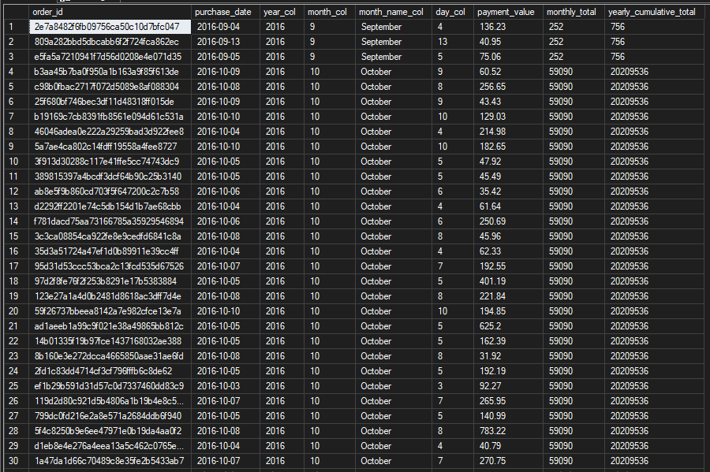

---

## Q35. 7-Day Moving Average Revenue

**Question:** Calculate daily revenue and its 7-day moving average.

**Answer:**

```sql
with join_seg as (
select cast (o.order_purchase_timestamp as date) as purchase_date,
sum(p.payment_value) as total_sales
from orders o join payments p
on o.order_id = p.order_id
group by cast (o.order_purchase_timestamp as date)
)
select purchase_date, total_sales,
AVG (total_sales) over (order by purchase_date
rows between 6 preceding and current row) as rolling_avg
from join_seg
order by purchase_date
```

**Output:**

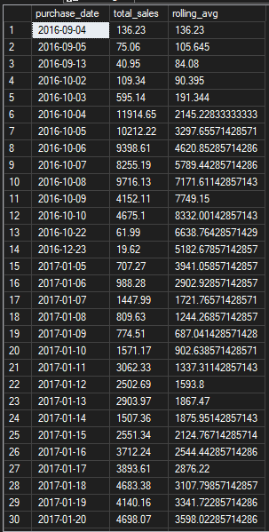

---

## Q36. 3-Month Moving Average Revenue

**Question:** Calculate monthly revenue and its 3-month moving average.

**Answer:**

```sql
with join_seg as (
select cast (o.order_purchase_timestamp as date) as purchase_date,
round (SUM(p.payment_value),0) as total_sales
from orders o join payments p
on o.order_id = p.order_id
group by cast (o.order_purchase_timestamp as date)
),
date_ext as (
select purchase_date,total_sales,
YEAR (purchase_date) as year_col,
DATENAME(MONTH,purchase_date) as month_col,
MONTH (purchase_date) as month_num_col
from join_seg
),
cum_seg as (
select purchase_date, year_col, month_col, month_num_col, total_sales,
SUM (total_sales) over (partition by year_col, month_col) as cum_month
from date_ext
),
month_order as (
select year_col, month_col, month_num_col, cum_month
from cum_seg group by year_col, month_col, month_num_col, cum_month
)
select year_col, month_col, month_num_col, cum_month,
AVG (cum_month) over 
(Order by year_col, month_num_col 
rows between 2 preceding and current row) as rolling_avg
from month_order
order by year_col, month_num_col
```

**Output:**

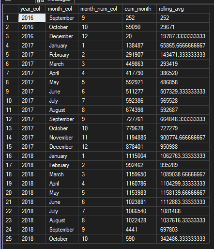

---

## Q37. Products with Revenue Above Their 3-Month Moving Average

**Question:** For each product, calculate monthly revenue and compare it with its 3-month moving average revenue.

**Answer:**

```sql
with table_joining as (
select p.product_category_name_english as pro_category,
oi.price, o.order_purchase_timestamp as pur_date
from order_items oi join orders o
on oi.order_id = o.order_id
join products p
on oi.product_id = p.product_id
),
date_extract as (
select CAST (pur_date as date) as pur_date, pro_category, round (price, 0) as 
sales,
YEAR (pur_date) as year,
DATENAME(MONTH,pur_date) as month,
MONTH (pur_date) as month_num
from table_joining
),
grouping_segment as (
select pro_category, 
year, month, 
month_num, 
sum(sales) as total_sales
from date_extract
group by pro_category,
year, month, month_num
),
roll_avg as (
select pro_category, year, month, month_num, total_sales,
round (AVG (total_sales) 
over (partition by pro_category
order by pro_category, year, 
month_num rows between 2 preceding and current row), 0)
as rolling_avg
from grouping_segment
)
select pro_category, year, month, month_num, total_sales, rolling_avg
from roll_avg
where total_sales > rolling_avg;
```

**Output:**

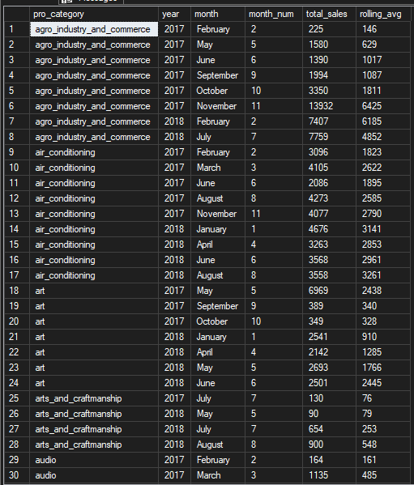

---

## Q38. First Purchase Date of Every Customer

**Question:** Find the first order date for every unique customer.

**Answer:**

```sql
with join_seg as (
select c.customer_unique_id as customer_id,
cast (o.order_purchase_timestamp as date) as pur_date
from customers c join orders o
on c.customer_id = o.customer_id
),
dis_seg as (
select distinct customer_id, pur_date
from join_seg
),
rank_seg as (
select customer_id, pur_date,
RANK () over (partition by customer_id order by pur_date) as rank
from dis_seg
)
select customer_id, pur_date, rank
from rank_seg
where rank = 1;
```

**Output:**

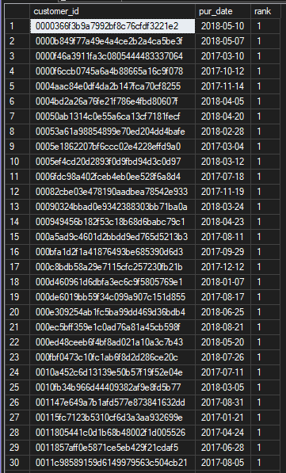

---

## Q39. Latest Purchase of Every Customer

**Question:** For every customer, return the latest order ID, latest order date, and payment value.

**Answer:**

```sql
with table_join as (
select c.customer_unique_id as customer_id, o.order_id,
o.order_purchase_timestamp, p.payment_value as price
from customers c join orders o
on c.customer_id = o.customer_id
join payments p
on o.order_id = p.order_id
),
dis_seg as (
select customer_id,
CAST (order_purchase_timestamp as date) as pur_date,
price, order_id
from table_join
),
rank_seg as (
select customer_id, pur_date, price, order_id,
RANK () over (partition by customer_id order by pur_date desc) as rank
from dis_seg
)
select customer_id, order_id, pur_date, price, rank
from rank_seg
where rank = 1;
```

**Output:**

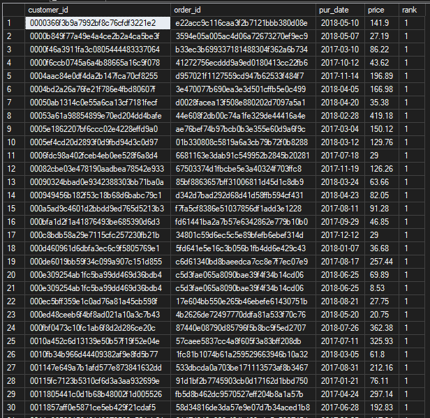

---

## Q40. First Product Purchased by Every Customer

**Question:** Identify the first product purchased by each customer.

**Answer:**

```sql
with join_seg as (
select c.customer_unique_id as customer_id,
o.order_id, o.order_purchase_timestamp as pur_date,
oi.price, p.product_category_name_english as pro_category
from customers c join orders o
on c.customer_id = o.customer_id
join order_items oi
on o.order_id = oi.order_id
join products p 
on oi.product_id = p.product_id
),
date_seg as (
select customer_id, 
order_id, 
pur_date, 
round (price, 0) as price, 
pro_category
from join_seg
),
rank_seg as (
select customer_id, order_id, pur_date, price, pro_category,
ROW_NUMBER () over (partition by customer_id order by pur_date) as rank
from date_seg
)
select customer_id, 
order_id, 
pro_category, 
pur_date, 
price, 
rank
from rank_seg
where rank = 1;
```

**Output:**

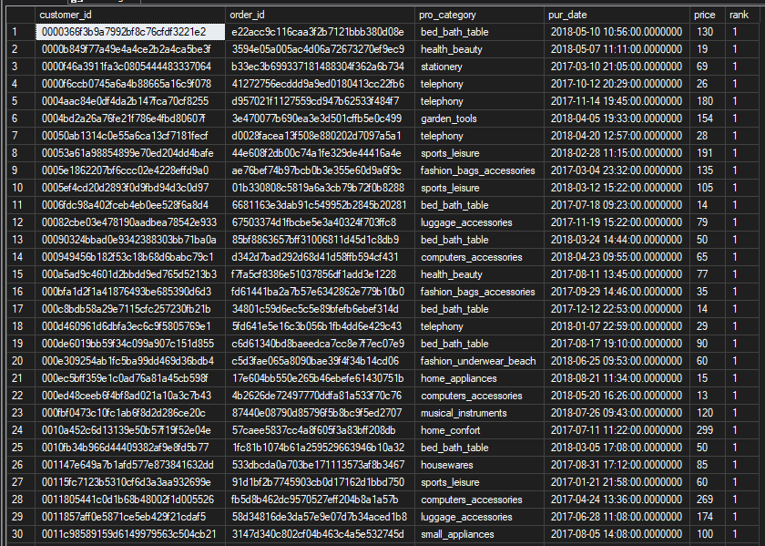

---

## Q41. Month-over-Month Revenue Growth

**Question:** Calculate monthly current month's revenue, previous month's revenue, revenue difference, and MoM growth %.

**Answer:**

```sql
with join_seg as (
select o.order_purchase_timestamp as pur_date,
p.payment_value as sales
from orders o join payments p
on o.order_id = p.order_id
),
date_join as (
select cast (pur_date as date) as pur_date,
YEAR (pur_date) as year,
MONTH (pur_date) as month,
DATENAME (MONTH, pur_date) as month_num,
sales
from join_seg
),
sum_seg as (
select year, month, month_num,
round (SUM (sales), 0) as month_sales
from date_join
group by year, month, month_num
),
lag_seg as (
select year, month, month_num, month_sales,
LAG (month_sales) over (order by year, month) as previous_month
from sum_seg
)
select year, month, month_num, month_sales, previous_month,
(month_sales - previous_month) as difference,
Round (((month_sales - previous_month) / previous_month) * 100, 0) as mom
from lag_seg
```

**Output:**

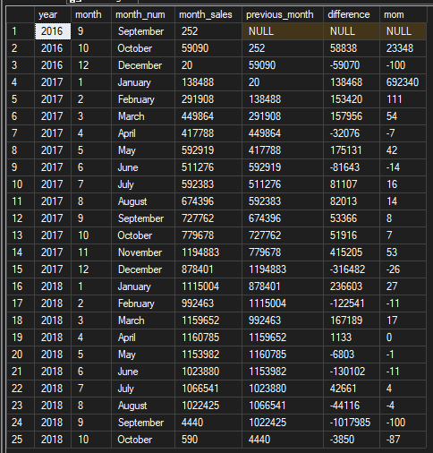

---

## Q42. Customer's Current Purchase vs Previous Purchase

**Question:** For repeat customers, compare the current purchase amount, previous purchase amount, and difference.

**Answer:**

```sql
with join_seg as (
select o.order_id, cast (o.order_purchase_timestamp as date) as pur_date,
c.customer_unique_id as customer_id, p.payment_value as price
from orders o join customers c
on o.customer_id = c.customer_id
join payments p on
o.order_id = p.order_id
),
lag_seg as (
select customer_id, order_id, pur_date, price,
LAG (price) over (partition by customer_id order by customer_id, pur_date) as 
previous_order_price
from join_seg
)
select customer_id, order_id, pur_date, price, previous_order_price,
(price - previous_order_price) as difference
from lag_seg
where (price - previous_order_price) is not null;
```

**Output:**

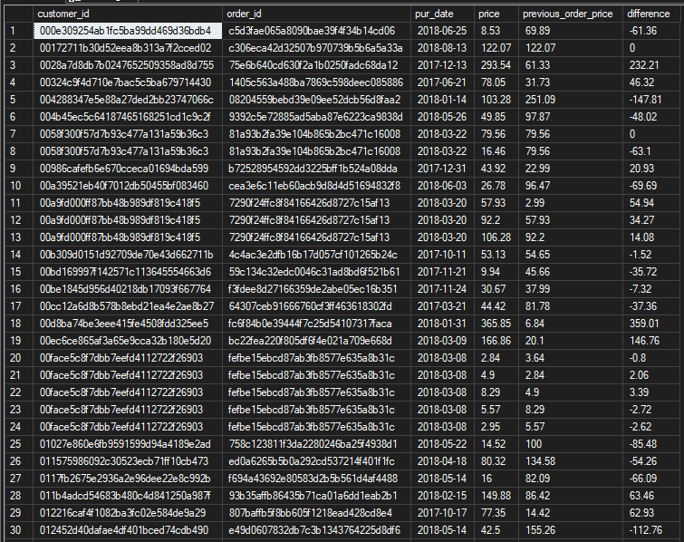

---

## Q43. Days Between Customer Purchases

**Question:** Calculate the number of days between a customer's current order and previous order.

**Answer:**

```sql
with join_seg as (
select o.order_id, cast (o.order_purchase_timestamp as date) as pur_date,
c.customer_unique_id as customer_id
from orders o join customers c
on o.customer_id = c.customer_id
),
lag_seg as (
select customer_id, pur_date,
LAG (pur_date) over (partition by customer_id order by customer_id, pur_date) as 
date_shift
from join_seg
),
date_diff as (
select customer_id, pur_date, date_shift,
DATEDIFF (day, date_shift, pur_date) as date_difference 
from lag_seg
)
select customer_id, pur_date, date_shift, date_difference
from date_diff
where date_difference is not null;
```

**Output:**

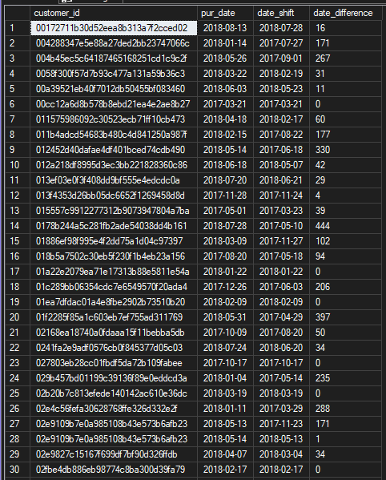

---

## Q44. Create Customer Purchase Sessions

**Question:** For each customer, assign a session number where a new session begins when the gap between purchases is greater than 30 minutes.

**Answer:**

```sql
with join_seg as (
select o.order_purchase_timestamp as purchase_date,
c.customer_unique_id as customer_id
from orders o join customers c
on o.customer_id = c.customer_id
),
lag_seg as (
select customer_id, purchase_date,
LAG (purchase_date) 
over (partition by customer_id order by customer_id, purchase_date) as 
previous_date from join_seg
),
case_seg as (
select customer_id, purchase_date, previous_date,
case
when previous_date is null then 1
when datediff (minute, previous_date, purchase_date) > 30 then 1
else 0
end as new_session
from lag_seg
)
select customer_id, purchase_date, previous_date, new_session,
SUM (new_session) over (partition by customer_id order by purchase_date
rows unbounded preceding) as session_no
from case_seg
```

**Output:**

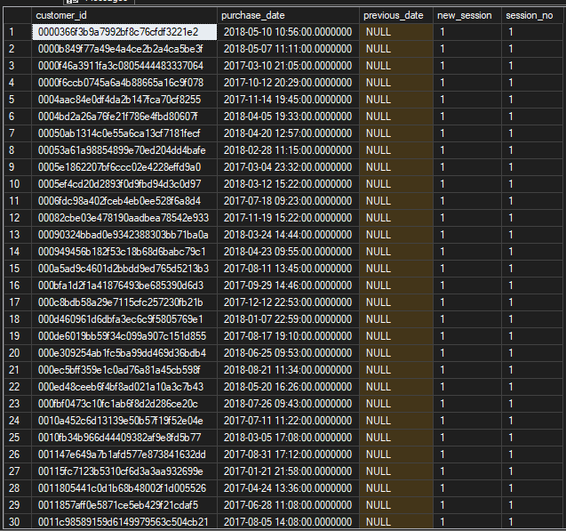

---

## Q45. Number of Purchase Sessions per Customer

**Question:** Calculate the total number of purchase sessions for every customer.

**Answer:**

```sql
with join_seg as (
select o.order_id , cast (o.order_purchase_timestamp as date) as purchase_date,
c.customer_unique_id as customer_id
from orders o join customers c
on o.customer_id = c.customer_id
)
select customer_id, order_id, purchase_date,
ROW_NUMBER () 
over (partition by customer_id order by purchase_date, order_id) 
as total_purchase_session
from join_seg;
```

**Output:**

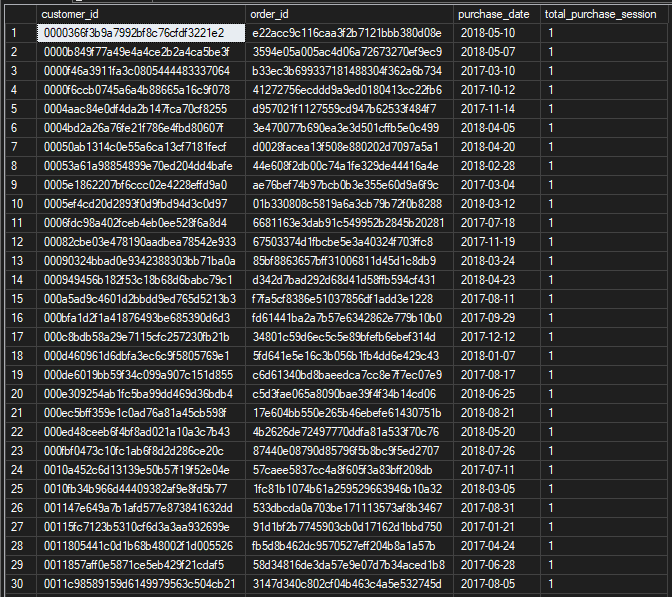

---

## Q46. Customers with Multiple Purchases in One Session

**Question:** Identify customers who made more than one purchase within the same 30-minute session.

**Answer:**

```sql
with join_seg as (
select o.order_id, o.order_purchase_timestamp as purchase_date,
c.customer_unique_id as customer_id
from orders o join customers c
on o.customer_id = c.customer_id
),
lag_seg as (
select customer_id, order_id, purchase_date,
LAG (purchase_date) 
over (partition by customer_id order by purchase_date, order_id) as 
date_shift
from join_seg
),
difference_seg as (
select customer_id, order_id, purchase_date, date_shift,
DATEDIFF (MINUTE, date_shift, purchase_date) as difference
from lag_seg
)
select customer_id, order_id, purchase_date, date_shift, difference
from difference_seg where difference <= 30;
```

**Output:**

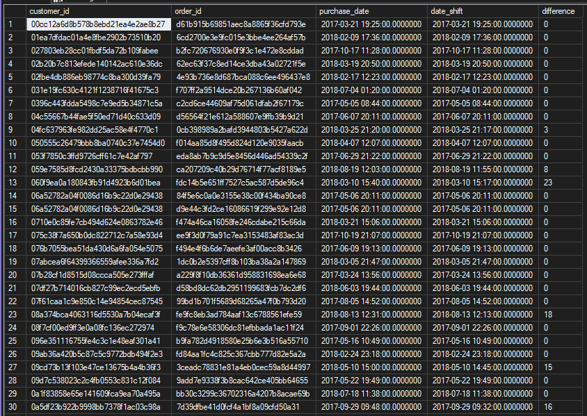

---

## Q47. Monthly Order-Status Summary

**Question:** For each month calculate:
- Purchase orders
- Shipped orders
- Delivered orders

**Answer:**

```sql
with name_given as (
select cast (order_purchase_timestamp as date) as date,
order_purchase_timestamp as order_date,
order_delivered_carrier_date as shipping_date,
order_delivered_customer_date as delivered_date
from orders
),
date_sep_seg as (
select YEAR (date) as year,
MONTH (date) as month,
DATENAME (MONTH, date) as month_name,
order_date, shipping_date, delivered_date
from name_given
),
count_seg as (
select year, month, month_name, 
count(order_date) over (partition by year, month order by year, month) as 
order_date,
count(shipping_date) over (partition by year, month order by year, month) as 
shipping_date,
COUNT (delivered_date) over (partition by year, month order by year, month) as 
delivered_date
from date_sep_seg
)
select * from count_seg
group by year, 
month, 
month_name, 
order_date, 
shipping_date, 
delivered_date
order by year, month
```

**Output:**

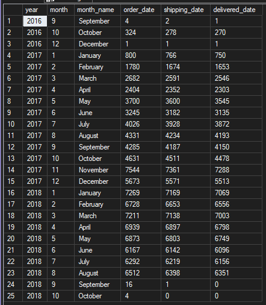

---

## Q48. Payment Method Performance

**Question:** For every payment type calculate:
- Number of orders
- Total payment value
- Average payment value

**Answer:**

```sql
select payment_type,
COUNT (distinct order_id) as Number_of_orders,
SUM (payment_value) as Total_payment_value,
Avg (payment_value) as Average_payment_value 
from payments
group by payment_type;
```

**Output:**

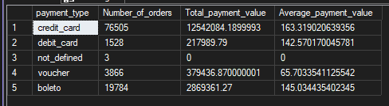

---

## Q49. Customer Repeat-Purchase Classification

**Question:** Classify customers into:
- One-time customer
- Customer with 2 purchases
- Customer with more than 2 purchases

**Answer:**

```sql
select customer_id,
case
when count(customer_id) = 1 then 'One time customer'
when count(customer_id) = 2 then 'Two-time customer'
else 'More than time customer'
end as Customer_Classification
from orders
group by customer_id;
```

**Output:**

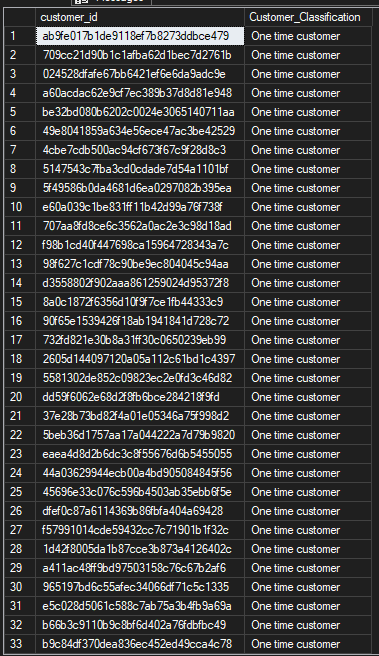

---

## Q50. Find Duplicate Review IDs

**Question:** Identify review_id values that appear more than once.

**Answer:**

```sql
select review_id
from reviews
group by review_id
having count (*) > 1;
```

**Output:**

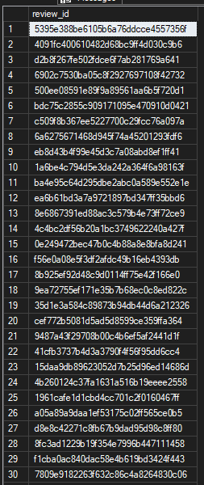

---

## Q51. Keep Only the Latest Review Record

**Question:** If the same review_id appears multiple times, retain only the record with the latest review_answer_timestamp.

**Answer:**

```sql
with group_seg as (
select review_id, 
review_answer_timestamp,
ROW_NUMBER () 
over (partition by review_id 
order by review_answer_timestamp desc) as rank
from reviews
)
select review_id, 
review_answer_timestamp, 
rank
from group_seg
where rank = 1;
```

**Output:**

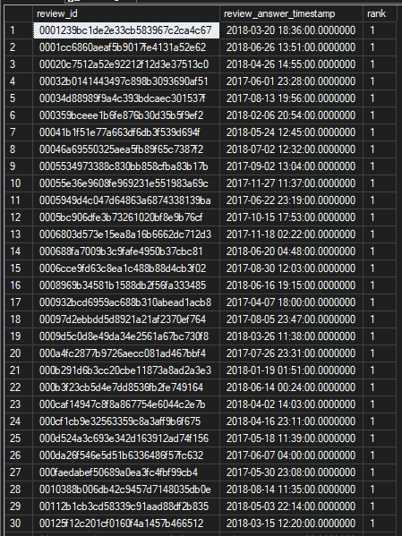

---

## Q52. Find Customers with Multiple Customer Records

**Question:** Using customer_unique_id, identify customers who have more than one customer_id.

**Answer:**

```sql
select customer_unique_id
from customers
group by customer_unique_id
having COUNT (customer_id) > 1;
```

**Output:**

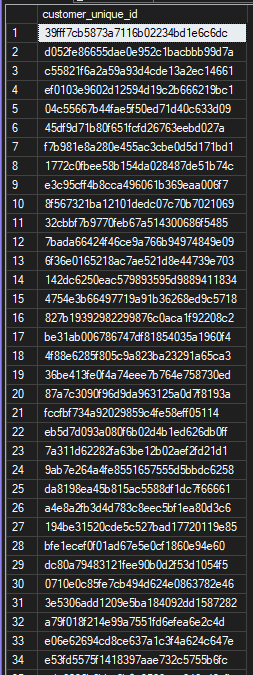

---

## Q53. Identify Each Customer's Acquisition Cohort Month

**Question:** Find the month in which each customer made their first purchase.

**Output:**
- customer_unique_id
- cohort_month

**Answer:**

```sql
with join_seg as (
select o.order_id, 
cast (o.order_purchase_timestamp as date) as date,
c.customer_unique_id as customer_id
from orders o join customers c
on o.customer_id = c.customer_id
),
rank_seg as (
select customer_id, order_id, date,
ROW_NUMBER () over 
(partition by customer_id order by date) as rank
from join_seg
)
select customer_id, order_id, date,
YEAR (date) as year, 
MONTH (date) as month,
datename(month, date) as month_name
from rank_seg
where rank = 1
order by date;
```

**Output:**

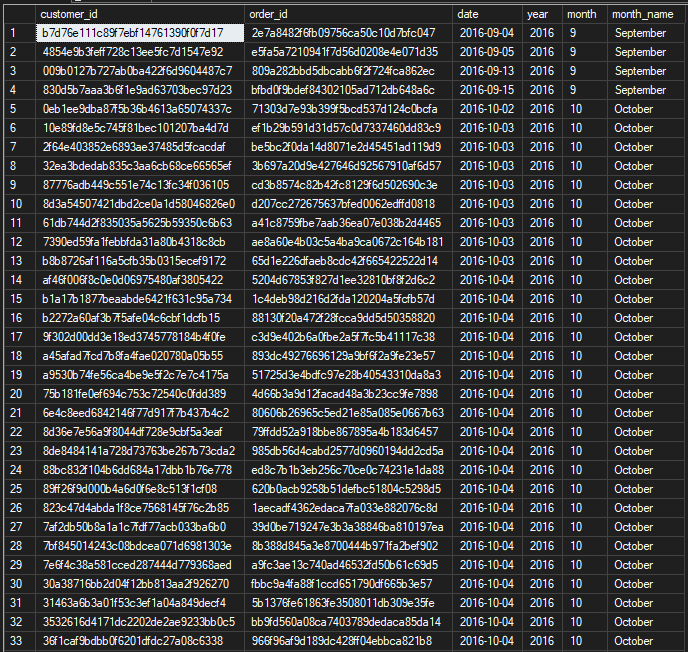

---

## Q54. Customers Who Made Their Second Purchase Within 30 Days

**Question:** Identify customers whose second purchase happened within 30 days of their first purchase.

**Answer:**

```sql
with join_seg as (
select c.customer_unique_id as customers_id,
cast (o.order_purchase_timestamp as date) as pur_date
from orders o join customers c
on o.customer_id = c.customer_id
),
rank_seg as (
select customers_id, pur_date,
ROW_NUMBER () 
over (partition by customers_id order by pur_date) as rank
from join_seg
),
filter_seg as (
select customers_id, pur_date, rank
from rank_seg
where rank <= 2
),
pre_date as (
select customers_id, pur_date, rank,
LAG (pur_date) 
over (partition by customers_id order by pur_date) as previous_date
from filter_seg
)
select customers_id, pur_date, rank, previous_date,
DATEDIFF(DAY,previous_date,pur_date) as day_difference
from pre_date
where rank = 2 and DATEDIFF(DAY,previous_date,pur_date) <= 30;
```

**Output:**


